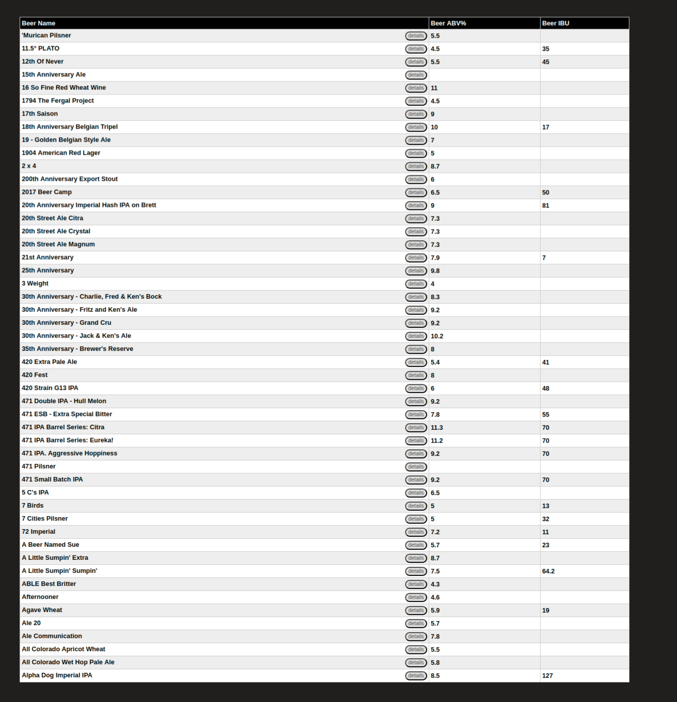

# Simple Beer List Application

Simple beer list app built based on https://www.brewerydb.com/ API using simple Node server as proxy for the API. And with small and necessary npm packages for server and client side in case the app goes online it will be lighter on the server and response faster.

#### React Client Side Development:

Used create react app then and fetch the server url and set the data to the state then used 2 route to build the app and the 2nd page get the data throw the URL route.

In the project directory, you can run:

### `npm start`

The command line will trigger the node server and the create react app credentials together by using concurrently npm package.

### Deployment

The app needs KEY, URL and ENDPOINT from https://www.brewerydb.com/developers/apps in .env file for the server.

#### spiner

#### First Page

#### Second Page

